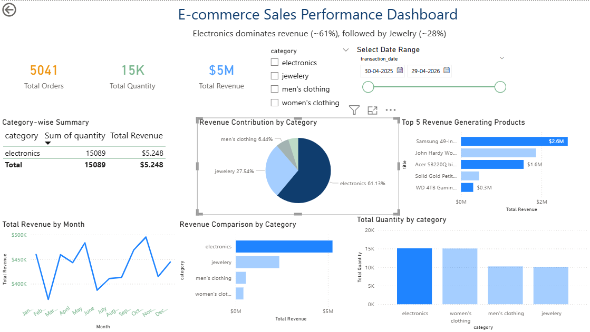

# ecommerce-sales-powerbi-dashboard
Interactive Power BI dashboard analyzing e-commerce sales performance, revenue trends, and top products.

# Project Overview
This project presents an interactive dashboard built using Power BI to analyze e-commerce sales data. It provides insights into revenue trends, product performance, and category-wise contributions.

#  Key Features
- KPI tracking (Total Revenue, Total Orders, Total Quantity)
- Category-wise revenue analysis
- Top 5 revenue-generating products
- Monthly revenue trend analysis
- Interactive filters (Category & Date)

# Key Insights
- Electronics contributes ~61% of total revenue
- Jewelry accounts for ~28% of revenue
- Top 5 products drive a significant portion of total sales
- Revenue trends show fluctuations across months

# Tools & Technologies
- Power BI
- DAX (Data Analysis Expressions)
- Power Query (Data Transformation)

# Files Included
- `Ecommerce_Sales_Dashboard.pbix` – Power BI dashboard file
- `dashboard.png` – Dashboard preview

# Dashboard Preview

# Conclusion
This dashboard helps in understanding sales performance and supports data-driven decision-making for business growth.
